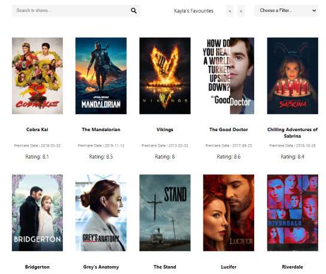

<!-- ABOUT THE PROJECT -->
## About The Project

 

Simple application built to practice filtering/sorting, unit tests hosting and pagination.

[Visit Website](https://movie-application-demo.herokuapp.com/)

### Built With

* [Spring Boot](https://spring.io/projects/spring-boot)
* [Next.JS](https://nextjs.org/)
* [The Movie DB v.3](https://developers.themoviedb.org/3)

### Prerequisites

* [Java 11](https://www.oracle.com/java/technologies/javase-jdk11-downloads.html) 
* [Node.js](https://nodejs.org/en/)
* [npm](https://www.npmjs.com/)

Project Link: [https://github.com/preeti13456/movie-app](https://github.com/preeti13456/movie-app)
